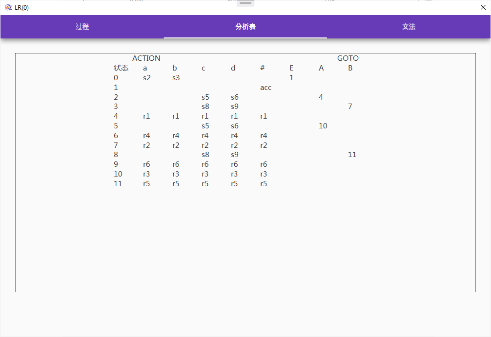

# LR(0)分析器自动构造程序的实现

## 一、设计目的及设计要求

**设计目的：**LR(0)分析器自动构造程序的实现

**设计内容及要求：**对任意给定的文法G，构造识别文法活前缀的DFA，输出DFA的状态转化矩阵及LR(0)项目集规范族；实现LR(0)分析表构造算法；实现LR分析器总控程序。程序输出一个完整的LR(0)分析器源程序，可输出到指定文件中。

## 二、开发环境描述

开发环境为Windows10下的Microsoft Visio studio 2022，使用C# .NET Core6.0和WPF完成项目开发。

## 三、设计内容、主要算法描述

LR分析法：是一种有效的自底向上的分析方法，是一种“移进-归约”分析方法， 1965年 由Knuth提出。L表示从左向右扫描输入串（read from Left to right），R表示构造最右推导的逆过程（for constructing a Rightmost derivation in reverse）。大多数用上下文无关文法描述的高级语言的语法成分可以用LR分析器来识别。LR(0)分析根据当前分析栈中的符号串和向右顺序查看输入串就可以确定分析的动作是移进还是归约。

自底向上分析法的关键问题是如何确定可归约的串。LR(0)分析方法是通过求句柄逐步归约来进行语法分析。

在完成LR(0)分析器自动构造程序的实现的过程中，将实现方式分为以下步骤：

## 四、运行结果

